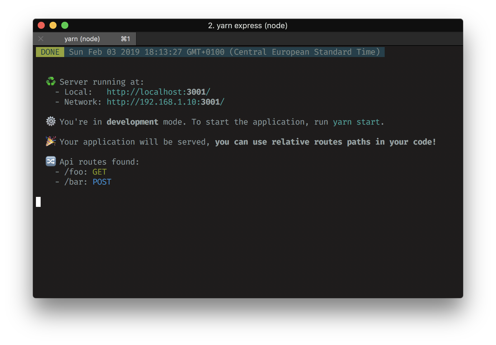

# serve-my-app

[ ](https://www.npmjs.com/package/serve-my-app)


**🚀  Serve your Javascript application and/or add an API to it in a minute!**

This package allows you to add a NodeJS Express server easily and quickly to your Javascript application.

<br>



<br>

**✨ Features:**

Includes a fully customizable Express Server, which allows you to:
  
 - Serve your Javascript application, with routing handling.
 - Add directly your api routes into your project, without thinking to something else.

## Table of contents

- [Getting started](#Getting-started)
- [Configuration](#Configuration)
- [Usage](#Usage)
- [FAQ](#FAQ)

------

## Getting started

In this ReadMe, we will take an example with a create-react-app application, and a @vue/cli one is coming. But it can be what you want, so please, let us know if you tested it with another framework or app. It will be added to this doc.

```bash
cd my-app
npm install serve-my-app express
```

Add the commands to your package.json

```json
"express": "serve-my-app --watch",
"express:run": "NODE_ENV=production serve-my-app"
```

## Configuration

The `serve-my-app` binary will serve your frontend and your api.

It has several configuration parameters. 

**See [usage](#usage) section to understand how to use them.**


Most useful ones:

| Option  | Default value | Usage                                                    |
| ------- | ------------- | -------------------------------------------------------- |
| --srv   | `'srv'`       | Relative path of your server **node compatible** files   |
| --src   | `'build'`     | Relative path of your front **browser compatible** files |
| --watch | `false`       | Restart server if change detected in `--srv` folder      |
| --serve | `true`        | Serve your frontend application                          |


Other ones:

| Option    | Default value                | Usage                                       |
| --------- | ---------------------------- | ------------------------------------------- |
| --prod    | `NODE_ENV === 'production'`  | Force production mode                       |
| --proxify | `true`                       | Proxify calls to express server in dev mode |
| --delay   | `false`                      | Delay launch by a small duration (300ms)    |
| --host    | `HOST` if set or `'0.0.0.0'` | Specify server host                         |
| --port    | `PORT` if set or ` 3001`     | Specify server port                         |
| --https   | ` HTTPS` if set or `false`   | Specify if url should use http              |


## Usage

### I only want to serve my frontend code in production

Nothing more to do, you're good to launch the commands:

```bash
npm run build
npm run express:run
```

### I only want to add some api routes.

1. You have to create a ` srv/index.js` file exporting a function, which will receive the Express application as its only parameter. 

   For example:

   ```javascript
   const { json } = require('express');
   
   module.export = app => {
       app.use(json());
   
       app.get('/foo', (req, res) => {
           res.json({msg: 'foo'});
       });
   
       app.post('/bar', (req, res) => {
           res.json(req.body);
       });
   }
   ```

2. Then you just have to set the `-—serve` flag to ` false` to not serve any frontend code, and you're good to go.

   ```bash
   serve-my-app [...] --serve=false
   ```

### I want to serve both my frontend code and add some api routes.

You have to create a `srv/index.js` file with your routes described like explained in 1.

Then :

- For development purpose:

  - Launch the server

    ```bash
    npm run express
    ```

    The server will automatically be restarted when a change is detected.

  - Launch the app:

    ```bash
    npm run start
    ```

    All the relative xhr/fetch calls made in the application will be proxyfied to the express server.

- To run the server only once for production:

  - Build your app files :

    ```bash
    npm run build
    ```

  - Launch the server

    ```bash
    npm run express:run
    ```

**👍 You can use relative urls for xhr/fetch calls in your code.**


## FAQ

### I want to use some transpilation process for my server (Webpack, TypeScript, ...).

And you're right, it's a good idea!

In that case, you just have to handle the compilation process on your own, and specify an other folder for `—srv` files. 

For example, for a TypeScript compilation, and an `"outDir": "../dist"` in `srv/tsconfig.json`, you can update your script in `package.json` as: 

```json
"build:express": "rm -rf dist && tsc -p srv",
"watch:express": "npm run build:express -- -w",
"express:run": "NODE_ENV=production serve-my-app --srv=dist"
```

**🔗 See a full example at: [mathieutu/starter-kit-react-express](https://github.com/mathieutu/starter-kit-react-express)**

### My `package.json` behaves in a weird manner: a `proxy` key comes and goes in it.

To proxify xhr calls from the front dev server to the express server, create-react-app uses a `proxy` key in the package.json. This is why this package adds it automatically in the file when it is launched in dev mode (when `--prod` is `false`), and removes it when it is stopped. 

This should be transparent for you, but if you want to disable this automatic adding, and handle yourself (or not) the proxy, you can do it by passing the `-—proxify` flag to `false`. 

You can find the documentation about proxies in create-react-app [here](https://facebook.github.io/create-react-app/docs/proxying-api-requests-in-development#docsNav).

### Another question?

Please feel free to [ask it](https://github.com/mathieutu/serve-my-app/issues/new)!


## License

This package is an open-sourced software licensed under the [MIT license](http://opensource.org/licenses/MIT).


## Contributing

Issues and PRs are obviously welcomed and encouraged, as well as new features and documentation.
